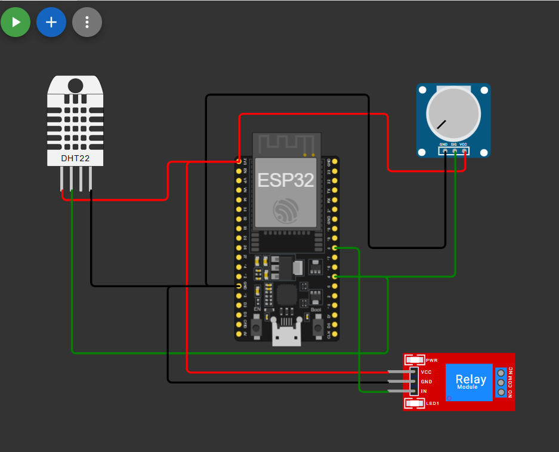

# Automatic Irrigation System (ESP32)

An ESP32-based system that measures temperature and soil moisture and waters plants automatically — only when needed, with no manual work and no wasted water.

## How it works

Every 3 seconds the ESP32:

1. Reads the temperature from a **DHT22** sensor.
2. Reads the soil moisture as an analog value (0–4095).
3. Turns the pump **on** through a relay if the soil is dry (below `dryThreshold`) **and** the temperature is below `maxTemp` (35 °C).
4. Otherwise turns the pump **off**.

**Fail-safe:** if the DHT22 cannot be read, the pump is switched off and the system waits before trying again, so a broken sensor never leaves the pump running.

## Hardware

| Component | Pin |
|---|---|
| ESP32 | – |
| DHT22 (temperature & humidity) | GPIO 4 |
| Soil moisture sensor (simulated by a potentiometer) | GPIO 34 |
| Relay module (pump) | GPIO 5 |

## Simulation

The circuit and firmware were designed and tested in Wokwi first:
**[Open the simulation](https://wokwi.com/projects/477174835757274113)**

In the simulation, click the DHT22 to change the temperature and turn the potentiometer to change the soil moisture.

## Status

- [x] Circuit and firmware tested in simulation
- [ ] Physical build with real components (in progress)
- [ ] Replace the potentiometer with a capacitive soil moisture sensor
- [ ] Connect a 5V water pump

## Tech

ESP32 · C/C++ (Arduino framework) · DHT22 · Relay module · Wokwi
